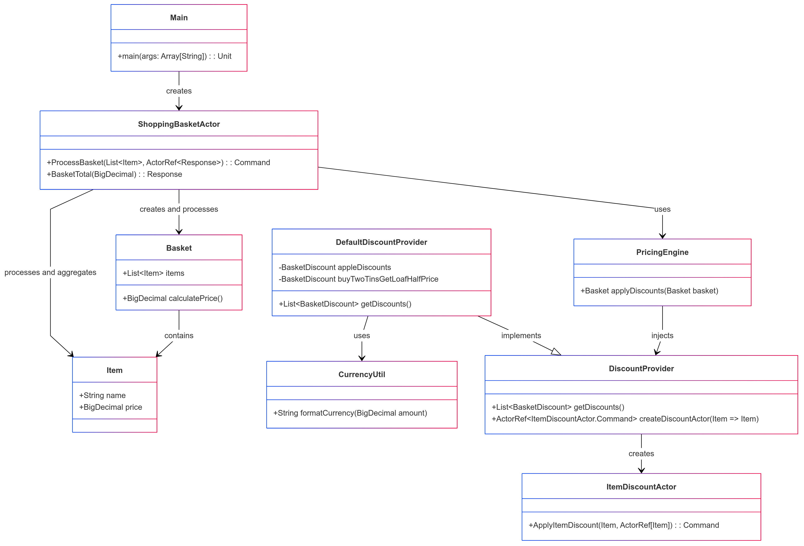

# Shopping Basket

This project is a Scala application that calculates the total price of items in a shopping basket, applying discounts as specified.

## Requirements

- Scala 2.13
- sbt 1.9.9 (Scala Build Tool)
- Java 11.0.22

## Dependencies

The project uses the following libraries:

- Typesafe Config
- ScalaTest
- ScalaCheck

These dependencies are managed via `sbt` and are specified in the `build.sbt` file.

## Building the Project

To build the project, run the following command:

```sh
sbt clean compile assembly
```

This will clean, compile, and create a fat JAR file for the project.

## Running the Application

To run the application, use the following command:

```sh
java -jar target/scala-2.13/ShoppingBasket-assembly-0.1.0-SNAPSHOT.jar <item1> <item2> ...
```

Replace `<item1>`, `<item2>`, etc., with the names of the items you want to add to the basket. For example:

```sh
java -jar target/scala-2.13/ShoppingBasket-assembly-0.1.0-SNAPSHOT.jar Soup Bread Milk
```

Note: The implementation of this app assumes all inputs of items are correctly spelled and exist in the configuration (described below). Case insensitivity is a trivial extension and can be added in the future. 
All item entries which are not exact string matches of the keys in the application.conf will not be included in the calculation. 

## Configuration

The application uses a configuration file (`application.conf`) to define the prices of items. The configuration file should be placed in the `src/main/resources` directory and should look like this:

```hocon
shoppingbasket {
  items {
    Soup = "0.65"
    Bread = "0.80"
    Milk = "1.30"
    Apples = "1.00"
  }
}
```

The application.conf in its current state matches the spec of the assignment.

## Testing

To run the tests, use the following command:

```sh
sbt test
```

This will execute all the unit and property-based tests defined in the project.

## Modules and Classes
The modules and class structure depend on the branch/tag currently being used. In the tag titled 'mvp' is a simple base scala application which uses a class injection 
to handle the introduction of new discounts should they be introduced in the future. 

### ER Diagram: MVP (base scala)


In the tag akka-mvp-local is an implementation of the shopping basket using the Akka framework to achieve concurrency and parallelism in the application of discounts at the item level. 

### ER Diagram: Akka-MVP (Scala, Akka, Runs Locally)


### DiscountProvider

### Tests

- `BasketSpec`: This class is defined in `src/test/scala/com/adthena/shoppingbasket/models/BasketSpec.scala`. It includes property-based tests using ScalaCheck to verify the correctness of the `calculatePrice` method in various scenarios.

## Using Docker

To use Docker for building and running the project, follow these steps:

1. **Pull the Docker image:**

   ```sh
   docker pull sbtscala/scala-sbt:eclipse-temurin-jammy-11.0.22_7_1.9.9_2.13.12
   ```

2. **Build the project:**

   ```sh
   docker build -t shopping-basket-sbt .
   ```
   
3. **Run the application:**
   ```sh
   docker run --rm shopping-basket-sbt Apples Apples Bread Soup
   ```
